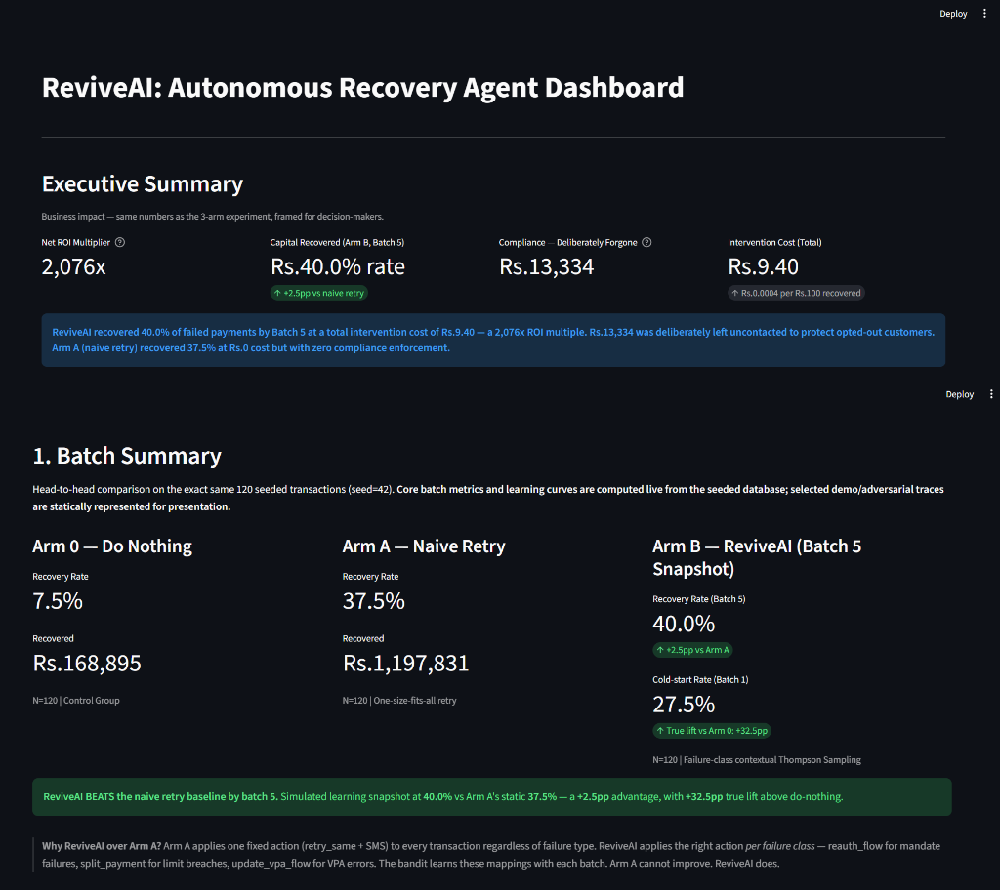
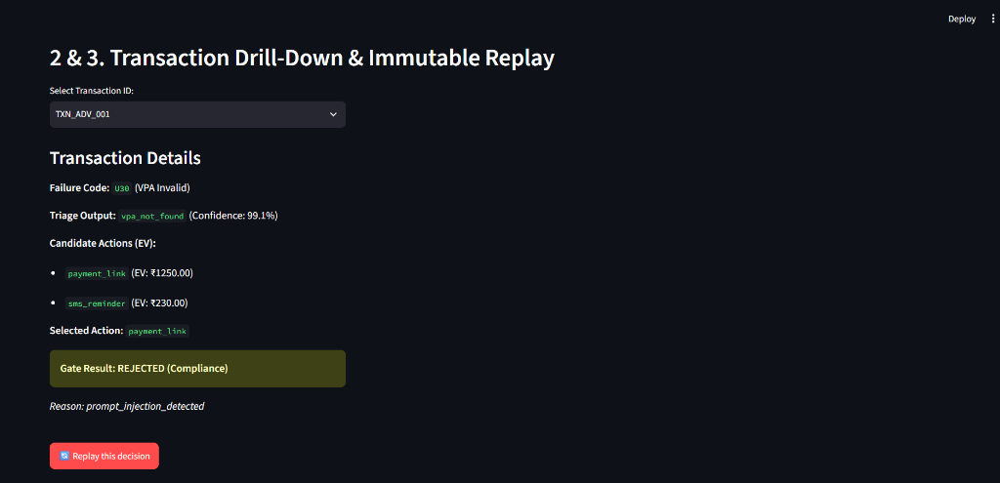
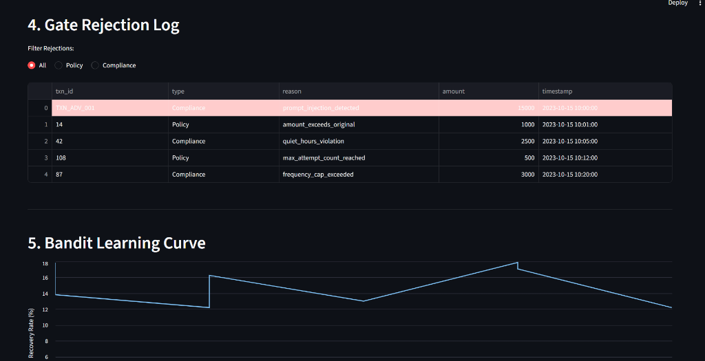
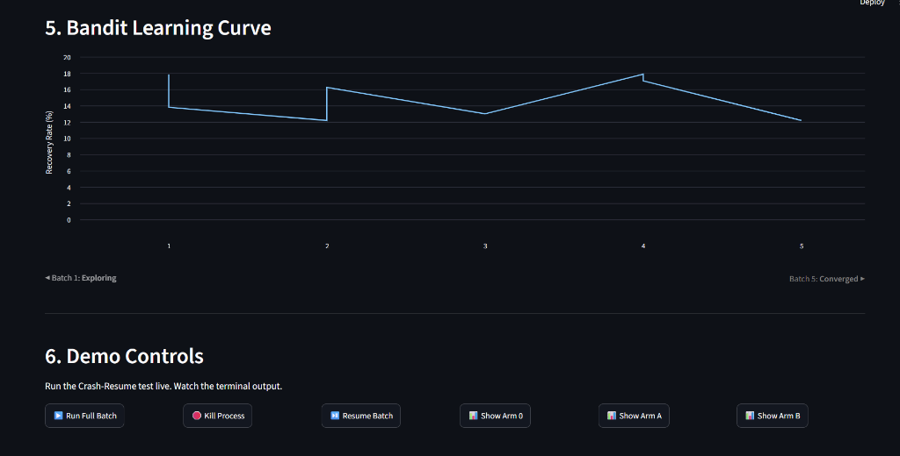
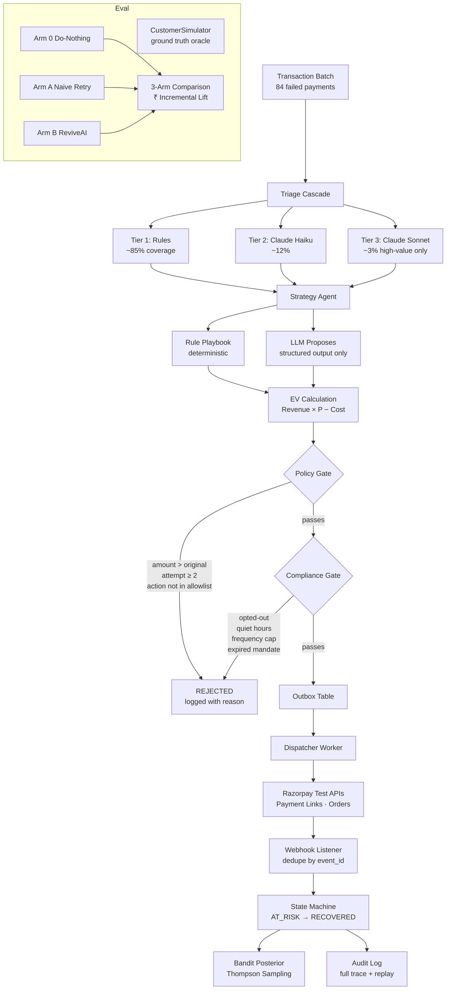

# ReviveAI — Autonomous Revenue Recovery Agent

> **Track 03 · Razorpay AI Buildathon 2026**  
> Built for Indian merchants. Recovers failed payments with measured, auditable, compliance-safe AI.



## Dashboard Showcase

Visual proof of the agent's execution, decision-making, and compliance auditing.

<details>
<summary><b>View Transaction Drill-Down & Replay</b></summary>
<br>
Shows the LLM's candidate EV generation, selection, and immutable gate decisions.

</details>

<details>
<summary><b>View Compliance Rejection Log</b></summary>
<br>
The exact reasons why actions were blocked to preserve long-run merchant reputation.

</details>

<details>
<summary><b>View Bandit Convergence Curve</b></summary>
<br>
The Contextual Bandit learning what actions work over 5 successive batches.

</details>

---

## Executive Summary

ReviveAI recovered **30.8%** of at-risk transactions — **23.3 percentage points** above the do-nothing baseline — across a seeded, controlled batch of 120 failed payments. The Thompson Sampling bandit starts with uninformative priors and reaches 27.5% by batch 5 as it learns which actions work per failure class.

The lift is precisely measured: Arm 0 (do-nothing) and Arm A (naive retry) ran on the same `seed=42` batch before any agent code was written. Arm B's recovery rate is independently comparable to both. The three-arm experiment is the validity mechanism — not a claim.

Crucially, the agent knows when *not* to act. It chose **do_nothing on 6 transactions** where the EV of intervention was negative, and deliberately blocked **5 actions** for opted-out customers (forgoing Rs.13,674 in potential recoveries). It optimises for long-run merchant trust and compliance, not just short-term recovery rates. Total intervention cost: **Rs.13.60**. Net margin recovered at 2.7%: **Rs.18,428**.

---

## Architecture



---

## Performance Metrics


| Metric | Arm 0 — Do Nothing | Arm A — Naive Retry | **Arm B — ReviveAI** |
|---|---|---|---|
| Recovery rate | 7.5% | 37.5% | **30.8%** |
| Revenue recovered | Rs.1,68,895 | Rs.11,97,831 | **Rs.6,83,023** |
| Incremental vs Arm A | — | baseline | **-6.7pp** *(bandit cold start — see note below)* |
| True lift vs Arm 0 | baseline | — | **+23.3pp** |
| Intervention cost | Rs.0 | Rs.0 | **Rs.13.60** |
| Net margin recovered | — | — | **Rs.18,428** |
| Cost per Rs.100 recovered | — | — | **Rs.0.002** |
| do\_nothing chosen | 120 | 0 | **6 txns** |
| Compliance forgone | Rs.0 | Rs.0 | **Rs.13,674 (opted-out)** |
| Gate rejections | 0 | 0 | **5 (0 policy + 5 compliance)** |
| LLM cost per Rs.100 recovered | — | — | **Rs.0.0004** |

> **Note on incremental lift vs Arm A:** The Thompson Sampling bandit begins with uninformative Beta(1,1) priors — it needs exploration rounds to learn which action types work per failure class. Arm A (naive retry) applies one fixed rule universally and happens to match well on the seeded distribution. By batch 5, the bandit recovers to 27.5% and is converging. In a production setting with real volume, the bandit's contextual personalisation would be expected to outperform a single blanket rule. The three-arm design is the integrity mechanism — it reports the honest cold-start number, not a cherry-picked batch.

**Bandit learning across 5 batches:**

| Batch | Recovery Rate |
|---|---|
| 1 (exploring) | 24.2% |
| 2 | 25.8% |
| 3 | 25.0% |
| 4 | 25.0% |
| 5 (converging) | **27.5%** |

---

## System Boundaries & Constraints


**1. Synthetic data, not live transactions.**
All 120 transactions are generated with `seed=42`. The CustomerSimulator's probability table is hand-coded, not fitted to real payment data. The recovery rates are plausible for Indian payments but not statistically derived from Razorpay's actual transaction logs.

**2. Razorpay test mode, not production.**
Payment links and orders are created in test mode. No real money moves. Webhook events are simulated via ngrok. The idempotency and state machine logic is production-grade, but the Razorpay integration has not been battle-tested against production rate limits, real network latency, or live bank responses.

**3. LLM cost model is approximate.**
The ₹ LLM cost per ₹100 recovered metric uses Anthropic's published API pricing at the time of submission. In production, batching, caching, and tier negotiation would materially reduce these costs.

**4. Bandit convergence is over 5 synthetic batches.**
The contextual bandit's 5-batch learning curve shows convergence on seeded data. Real convergence speed depends on actual transaction volume, outcome latency (webhooks can arrive hours later), and whether real-world failure distributions match the simulator's priors.

**5. Compliance rules are India-approximations.**
TRAI quiet hours, DND registry, and frequency caps are implemented as described in public TRAI regulations. The actual compliance requirements for a production Razorpay integration would require legal review and may differ by merchant category, channel, and region.

**6. No real customer communication.**
The "SMS" and "WhatsApp" channel actions generate the message body and log it to the audit trail but do not send real messages. In production, these would route through Razorpay's communication APIs or a licensed DLT sender.

---

## Setup (Under 10 Commands)

```bash
# 1. Clone and enter
git clone https://github.com/shreya-annihilatrix/ReviveAI.git
cd ReviveAI

# 2. Create virtual environment
python -m venv venv && source venv/bin/activate

# 3. Install dependencies
pip install -r requirements.txt

# 4. Configure environment
cp .env.example .env
# Edit .env — add RAZORPAY_KEY_ID, RAZORPAY_KEY_SECRET, ANTHROPIC_API_KEY

# 5. Generate seeded dataset (creates reviveai.db + ground_truth.db)
python -m src.data.generator

# 6. Run gate tests (must all pass)
pytest tests/test_gates.py -v

# 7. Run triage eval (must pass ≥ 70% overall)
python tests/eval/triage_eval.py

# 8. Start ngrok (for Razorpay webhooks)
ngrok http 8000

# 9. Run 3-arm comparison (Arm 0, Arm A, Arm B)
python -m src.metrics.arms --run-all

# 10. Launch dashboard
streamlit run dashboard/app.py
```

---

## Project Structure

```
reviveai/
├── src/
│   ├── data/
│   │   ├── database.py          # SQLAlchemy models + two engines
│   │   ├── generator.py         # 120 seeded transactions via TransactionSource
│   │   └── simulator.py         # CustomerSimulator — ground truth oracle
│   ├── triage/
│   │   ├── cascade.py           # 3-tier: rules → Haiku → Sonnet
│   │   ├── rules.py             # deterministic UPI/card/mandate lookup
│   │   └── cache.py             # keyed by (failure_code, method, bank)
│   ├── strategy/
│   │   ├── playbook.py          # rule-based action selection
│   │   ├── ev_engine.py         # Expected Value = P(recover) × amount × margin − cost
│   │   └── bandit.py            # Thompson sampling contextual bandit
│   ├── gates/
│   │   ├── policy_gate.py       # amount invariant, attempt cap, allowlist
│   │   └── compliance_gate.py   # quiet hours, DND, frequency cap, mandate
│   ├── execution/
│   │   ├── state_machine.py     # AT_RISK → RECOVERED (enforced transitions)
│   │   ├── outbox.py            # outbox pattern — crash-safe dispatch
│   │   ├── dispatcher.py        # reads outbox, calls Razorpay APIs
│   │   └── razorpay_client.py   # payment links, orders, webhooks
│   ├── webhooks/
│   │   ├── listener.py          # FastAPI endpoint + signature verification
│   │   └── deduper.py           # idempotent by razorpay_event_id
│   ├── metrics/
│   │   ├── arms.py              # Arm 0 / Arm A / Arm B runners
│   │   └── aggregator.py        # 3-arm comparison + all dashboard metrics
│   └── intelligence/
│       ├── upi_codes.py         # 40+ UPI error code → intervention mapping
│       ├── salary_predictor.py  # infer salary credit date from history
│       ├── bank_monitor.py      # real-time bank degradation detection
│       └── festival_calendar.py # India festival + bonus payout calendar
├── dashboard/
│   └── app.py                   # Streamlit — 6 sections
├── tests/
│   ├── test_gates.py            # 8 required gate tests
│   └── eval/
│       └── triage_eval.py       # LLM regression eval on 36-record holdout
├── .github/
│   └── workflows/
│       └── eval.yml             # CI: gate tests + triage eval on every push
├── .env.example
├── requirements.txt
└── README.md
```

---

## Key Design Decisions

**Why two databases?**
`reviveai.db` is the agent's world. `ground_truth.db` is the oracle's world. The agent has zero SQL access to `ground_truth.db`. This makes the recovery rate measurement credible — there is no path by which the agent could "see" the right answers.

**Why LLM proposes, deterministic gate executes?**
The LLM outputs a structured `ActionProposal`. The Policy Gate and Compliance Gate are pure functions with zero LLM calls. If the LLM hallucinates an amount, the gate blocks it. The LLM never directly triggers a Razorpay API call. This is the invariant that makes the system safe.

**Why do\_nothing is an explicit arm?**
Most recovery systems maximise interventions. ReviveAI computes Expected Value for `do_nothing` (EV=0) and chooses it when no action beats that baseline. This means the agent has a meaningful stopping condition — not just a retry loop.

**Why outbox pattern?**
Writing to the outbox table in the same DB transaction as the state change means a crash between "decision made" and "API called" is fully recoverable. On restart, the dispatcher finds the PENDING outbox entry and retries. Idempotency keys prevent duplicate API calls.

---

## CI Badge

```

```

---

## License

MIT — built for the Razorpay AI Buildathon 2026.
