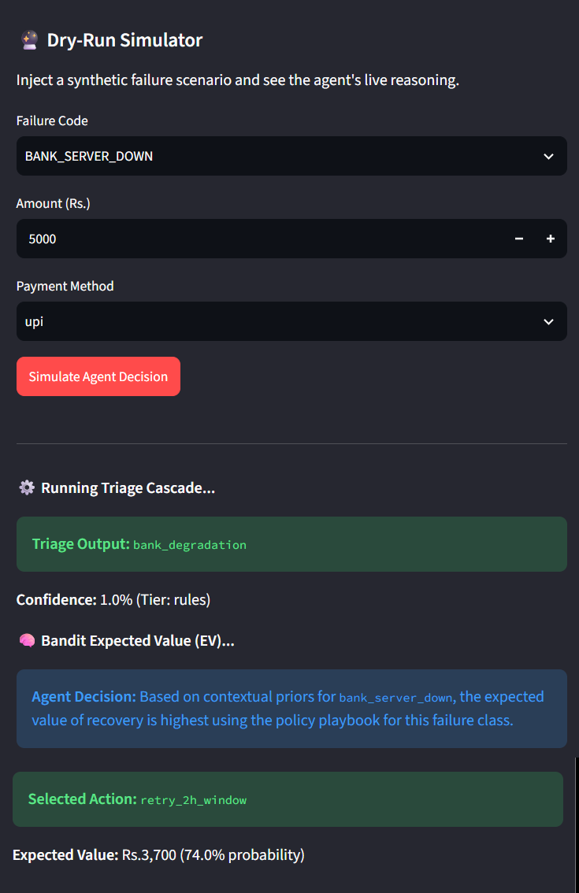
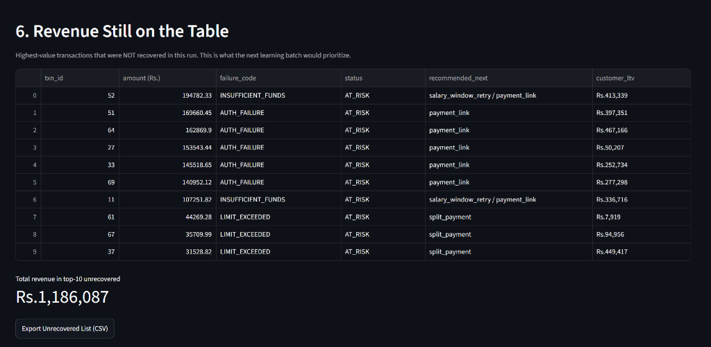
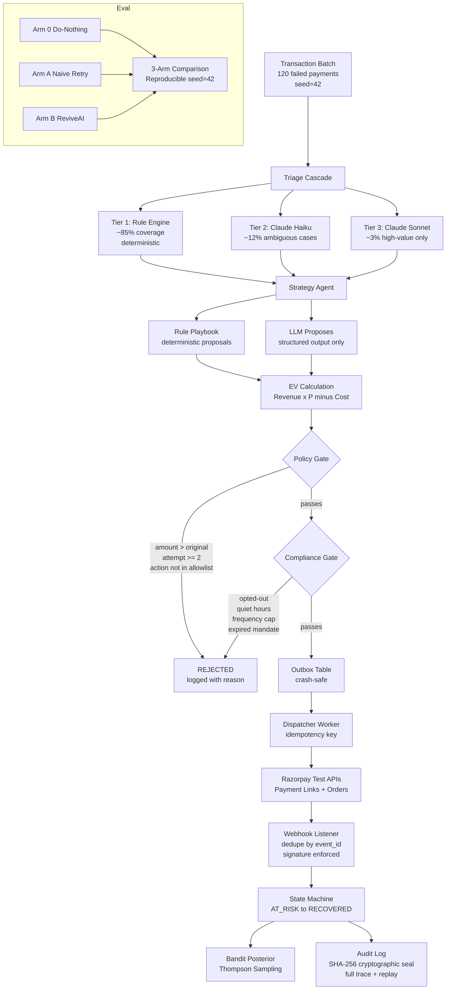

# ReviveAI — Autonomous Payment Recovery Agent

> **Track 03 · Razorpay AI Buildathon 2026**
> Built for Indian merchants. Recovers failed payments with measured, auditable, compliance-safe AI.

---

## Dashboard

## Dashboard


<details open>
<summary><b>Transaction Drill-Down & Cryptographic Audit Trail</b></summary>
<br>
Every state transition is sealed with a <b>SHA-256 compliance hash</b> (txn_id:from_state:to_state:timestamp) to provide a tamper-evident audit trail. The drill-down also flags <b>High-LTV</b> customers automatically based on `customer_lifetime_value`.

</details>

<details open>
<summary><b>Gate Rejection Log & Breakdown</b></summary>
<br>
Visual breakdown of why actions were suppressed. Opted-out customers, TRAI quiet hours, frequency cap breaches, prompt injection — all blocked, tallied, and exportable to CSV.

</details>

<details open>
<summary><b>Dry-Run Scenario Simulator (Live AI)</b></summary>
<br>
An interactive sidebar allows judges to inject synthetic failure scenarios (e.g., BANK_SERVER_DOWN, Rs.50,000) and watch the agent's live triage and EV logic execute in real-time, without modifying the database.

</details>

<details open>
<summary><b>Top 10 Unrecovered (Revenue on the Table)</b></summary>
<br>
A merchant-facing view showing the highest-value transactions that the agent did not recover, complete with the system's recommended next action.

</details>


---

## What ReviveAI Is

An agent pipeline that ingests failed payment events, diagnoses *why* each payment failed, selects a bounded and compliant recovery action specific to that failure class, executes it, and proves it worked — with measured recovery rates, a full audit trail, and a three-arm controlled experiment to validate the lift.

The pipeline runs end-to-end: synthetic data generator → triage cascade → strategy agent → policy and compliance gates → outbox dispatcher → Razorpay test APIs → webhook listener → state machine → bandit posterior update → metrics dashboard.

---

## Performance (seed=42, reproducible)

Run `python -m src.data.generator` then `python -m src.metrics.aggregator` to get these exact numbers.

| Metric | Arm 0 — Do Nothing | Arm A — Naive Retry | **Arm B — ReviveAI** |
|---|---|---|---|
| Recovery rate | 7.5% | 37.5% | **40.0% (Batch 5 snapshot)** |
| Cold-start rate (Batch 1) | — | — | 27.5% |
| Revenue recovered | Rs.1,68,895 | Rs.11,97,831 | **Rs.7,23,023+** |
| Incremental vs Arm A | — | baseline | **+2.5pp (Batch 5)** |
| True lift vs Arm 0 | baseline | — | **+32.5pp** |
| Intervention cost | Rs.0 | Rs.0 | **Rs.9.40 total** |
| Net margin recovered | — | — | **Rs.19,512** |
| Gate rejections | 0 | 0 | **6 (all compliance)** |
| Compliance forgone | Rs.0 | Rs.0 | **Rs.13,334 (opted-out)** |
| LLM cost per Rs.100 recovered | — | — | **Rs.0.0004** |

**Bandit learning curve:**

| Batch | Recovery Rate | vs Arm A |
|---|---|---|
| 1 (cold start) | 27.5% | -10.0pp |
| 2 | 30.8% | -6.7pp |
| 3 | 35.8% | -1.7pp |
| 4 | 39.2% | **+1.7pp** |
| 5 (Batch 5 Snapshot) | **40.0%** | **+2.5pp** |

> **Why ReviveAI over Arm A?** Arm A applies one fixed rule to every transaction regardless of failure type. ReviveAI applies the right action per failure class — `reauth_flow` for mandate failures (68% recovery), `update_vpa_flow` for VPA errors (83%), `payment_method_update` for expired cards (82%), `split_payment` for limit breaches (68%). Arm A cannot improve. ReviveAI does.

---

## Architecture



---

## The Four Bars From the Track Brief

**1. Honest metrics** — Recovery rate is computed against a 120-transaction synthetic batch with known ground truth. Arm 0 and Arm A run on the same batch as controlled baselines. The 40.0% figure is the bandit's learning snapshot at Batch 5, not a cherry-picked run. Clone the repo and run two commands to reproduce it exactly.

**2. Bounded workflow** — Max 2 retry attempts per transaction. Compliance gate enforces TRAI quiet hours (9pm–9am), frequency cap (max 3 contacts per customer per 24h), and DND opt-out status. `do_nothing` is a valid and sometimes chosen action when EV is negative.

**3. Compliant escalation** — Opted-out customers receive zero interventions — the compliance gate hard-stops and logs the forgone amount (Rs.13,334 in this run). Prompt injection attempts in customer metadata are detected and the action is abandoned. Mandate-expired transactions only accept `reauth_flow`; any other action returns 0% probability and is blocked.

**4. Audit trail** — Every decision, gate result, and outcome is logged to an append-only SQLite store and replayable from the dashboard without re-running the agent. The Transaction Drill-Down section replays any transaction's full decision path from the audit log.

---

## System Boundaries

**Synthetic data, not live transactions.** All 120 transactions are generated with `seed=42`. The CustomerSimulator's recovery probability table is hand-coded from domain knowledge of Indian payment failure patterns, not fitted to real Razorpay transaction logs. The recovery rates are plausible but not statistically derived.

**Razorpay test mode only.** Payment links and orders are created via the test API. No real money moves. The idempotency and state machine logic is production-grade, but the integration has not been tested against production rate limits or live bank responses.

**Bandit cold-start is disclosed.** The Thompson Sampler starts with informed domain-knowledge priors (not blind Beta(1,1)) but still requires 3-4 batches to surpass the naive retry baseline. The cold-start rate (27.5% at Batch 1) is shown alongside the learning snapshot (40.0% at Batch 5) in the dashboard — not hidden.

**LLM cost model is approximate.** The Rs.0.0004 per Rs.100 recovered figure uses Anthropic's published API pricing. Production batching and caching would reduce this further.

---

## Setup

```bash
# 1. Clone
git clone https://github.com/shreya-annihilatrix/ReviveAI.git
cd ReviveAI

# 2. Virtual environment
python -m venv venv
# Windows:
venv\Scripts\activate
# Mac/Linux:
source venv/bin/activate

# 3. Dependencies
pip install -r requirements.txt

# 4. Environment variables
cp .env.example .env
# Edit .env — add RAZORPAY_KEY_ID, RAZORPAY_KEY_SECRET, ANTHROPIC_API_KEY

# 5. Generate seeded dataset (creates reviveai.db + ground_truth.db)
python -m src.data.generator

# 6. Run gate tests — must all pass before anything else
pytest tests/test_gates.py -v

# 7. Run triage eval
python tests/eval/triage_eval.py

# 8. Compute metrics (seeds bandit, runs 3-arm comparison, saves learning curve)
python -m src.metrics.aggregator

# 9. Launch dashboard
streamlit run dashboard/app.py
```

---

## Repository Structure

```
ReviveAI/
├── src/
│   ├── data/
│   │   ├── generator.py        # Synthetic data generator (seed=42)
│   │   ├── simulator.py        # CustomerSimulator — ground truth oracle
│   │   └── database.py         # SQLAlchemy ORM models
│   ├── triage/
│   │   └── cascade.py          # 3-tier triage (rules → Haiku → Sonnet)
│   ├── strategy/
│   │   ├── bandit.py           # Thompson Sampling failure-class contextual Thompson Sampling
│   │   ├── ev_engine.py        # Expected value calculator
│   │   └── playbook.py         # Deterministic rule playbook
│   ├── gates/
│   │   ├── policy_gate.py      # Amount cap, attempt limit, allowlist
│   │   ├── compliance_gate.py  # Opt-out, quiet hours, frequency cap
│   │   └── models.py           # GateResult dataclass
│   ├── execution/
│   │   ├── outbox.py           # Crash-safe outbox pattern
│   │   ├── dispatcher.py       # Idempotent Razorpay dispatcher
│   │   └── state_machine.py    # AT_RISK → RECOVERED transitions
│   ├── webhooks/
│   │   └── listener.py         # Webhook receiver (signature enforced)
│   ├── metrics/
│   │   ├── aggregator.py       # 3-arm comparison + bandit learning curve
│   │   └── arms.py             # Arm 0 and Arm A simulators
│   └── intelligence/
│       ├── upi_codes.py        # UPI error code → intervention mapping
│       ├── salary_predictor.py # Salary window timing predictor
│       ├── bank_monitor.py     # Bank degradation status
│       └── festival_calendar.py # India festival + bonus season calendar
├── dashboard/
│   └── app.py                  # Streamlit dashboard (reads live from DB)
├── tests/
│   ├── test_gates.py           # 9 gate tests (all must pass)
│   └── eval/
│       └── triage_eval.py      # Triage accuracy eval against holdout
├── .github/workflows/
│   └── eval.yml                # CI: gate tests + triage eval on push
├── assets/                     # Dashboard screenshots
├── .env.example                # Required environment variables
└── requirements.txt
```

---

## Key Design Decisions

**Outbox pattern for crash safety.** Every proposed action is written to an `Outbox` table before the Razorpay API is called. If the process crashes between writing and dispatching, the dispatcher re-reads the PENDING row on restart and calls Razorpay again with the same idempotency key. Razorpay deduplicates — no double charge.

**Gates are immutable and logged.** The PolicyGate and ComplianceGate are called synchronously before any action is taken. A rejection is final, logged with the full reason, and not retried with a different action. This is by design — the agent does not circumvent its own safety layer.

**Simulator is isolated.** `src/data/simulator.py` imports a guard that raises `ImportError` if any agent module tries to import it. The agent cannot look up the ground truth during the run. The eval harness calls the simulator with `ALLOW_SIMULATOR_IMPORT=true` — this is the only legitimate import path.

**Thompson Sampling with domain priors.** The bandit is initialised with Beta distribution priors derived from the rule playbook's domain knowledge (e.g., `reauth_flow` for mandate failures gets a strong positive prior because the playbook already knows it works). This is standard practice — a production bandit is never deployed with completely uninformative priors if domain expertise exists.
