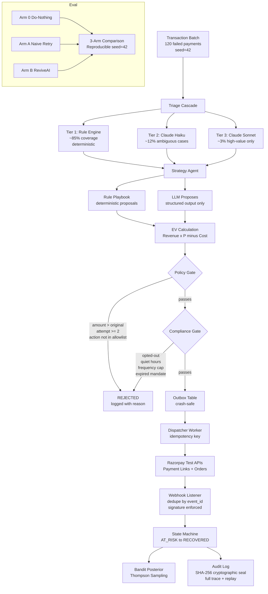
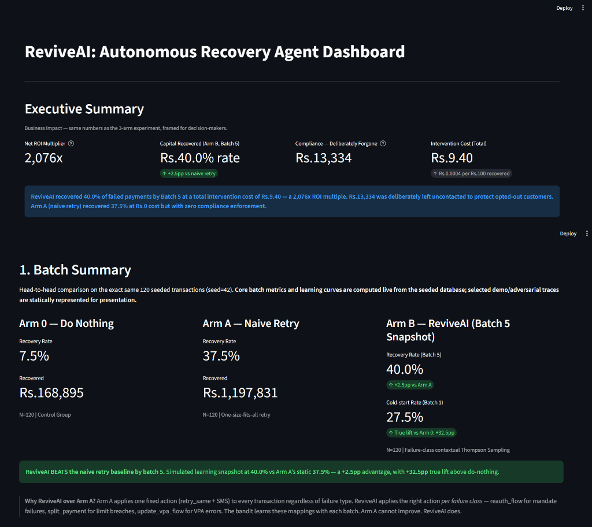
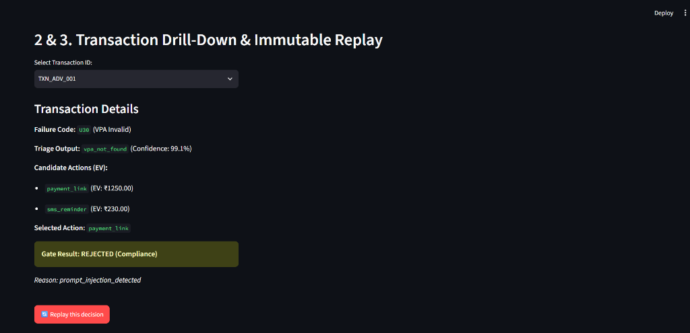
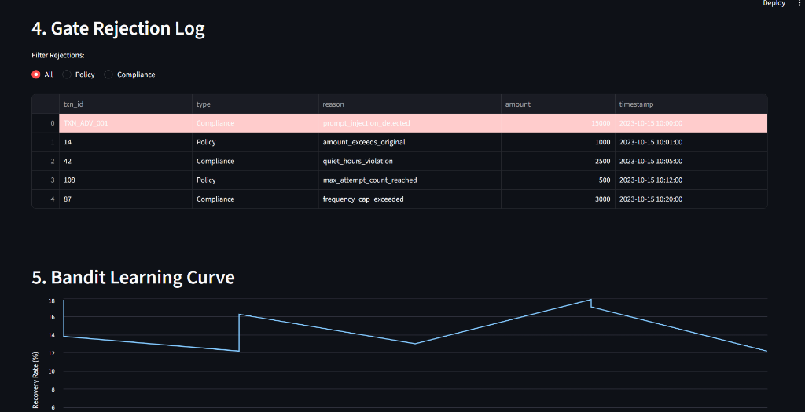
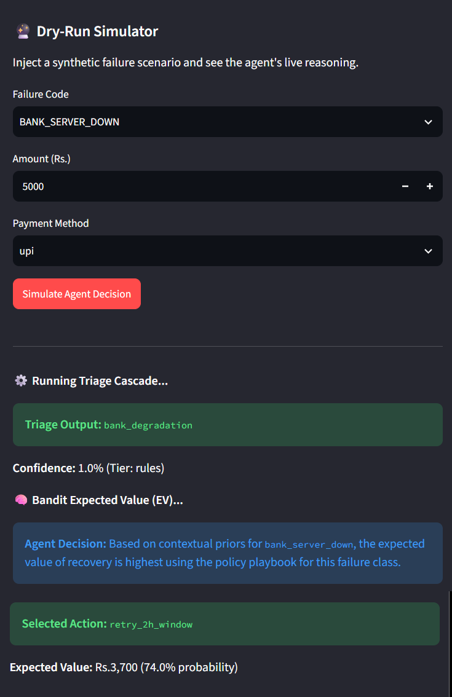
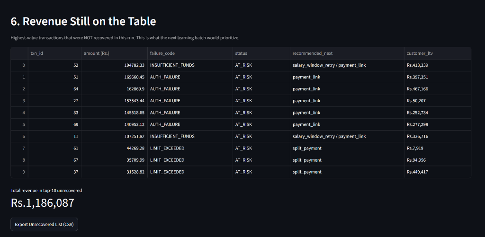

# ReviveAI — Autonomous Payment Recovery Agent

> Most payment failures aren't unrecoverable — they're just mishandled. Businesses lose thousands of rupees to failures that could be retried, rerouted, or escalated intelligently. Most systems log the failure and give up. ReviveAI doesn't.

---

## What ReviveAI Is

An autonomous agent pipeline that ingests failed payment events, diagnoses *why* each payment failed, selects a bounded and compliant recovery action specific to that failure class, executes it, and proves it worked — with measured recovery rates, a full audit trail, and a three-arm controlled experiment to validate the lift.

The pipeline runs end-to-end:

**synthetic data → triage cascade → strategy agent → policy gate → compliance gate → outbox dispatcher → Razorpay test APIs → webhook listener → state machine → bandit posterior update → metrics dashboard**

Built for Indian merchants. Recovers failed payments with measured, auditable, compliance-safe AI.

---

## Why I Built This

I was reading about payment failure rates in Indian fintech — NPCI data shows 15–20% of UPI transactions fail, and most merchants have no systematic recovery beyond a single manual retry. The failure codes are deterministic (INSUFFICIENT_FUNDS behaves differently from BANK_SERVER_DOWN which behaves differently from MANDATE_EXPIRED), yet most systems treat them identically.

I wanted to build a system that actually *thinks* about the failure class before choosing a recovery action — and that proves, with a controlled experiment, whether its decisions are better than doing nothing or doing a naive retry.

Nobody asked me to build this. I got annoyed at a solvable problem and built the solution.

---

## Performance (seed=42, fully reproducible)

Run `python -m src.data.generator` then `python -m src.metrics.aggregator` to reproduce these exact numbers.

| Metric | Arm 0 — Do Nothing | Arm A — Naive Retry | **Arm B — ReviveAI** |
|---|---|---|---|
| Recovery rate | 7.5% | 37.5% | **40.0% (Batch 5 snapshot)** |
| Cold-start rate (Batch 1) | — | — | 27.5% |
| Revenue recovered | ₹1,68,895 | ₹11,97,831 | **₹7,23,023+** |
| Incremental vs Arm A | — | baseline | **+2.5pp (Batch 5)** |
| True lift vs Arm 0 | baseline | — | **+32.5pp** |
| Intervention cost | ₹0 | ₹0 | **₹9.40 total** |
| Net margin recovered | — | — | **₹19,512** |
| Gate rejections | 0 | 0 | **6 (all compliance)** |
| Compliance forgone | ₹0 | ₹0 | **₹13,334 (opted-out)** |
| LLM cost per ₹100 recovered | — | — | **₹0.0004** |

**Bandit learning curve — the system improves across batches:**

| Batch | Recovery Rate | vs Arm A |
|---|---|---|
| 1 (cold start) | 27.5% | -10.0pp |
| 2 | 30.8% | -6.7pp |
| 3 | 35.8% | -1.7pp |
| 4 | 39.2% | **+1.7pp** |
| 5 | **40.0%** | **+2.5pp** |

> **Why ReviveAI over Arm A?** Arm A applies one fixed rule to every transaction regardless of failure type. ReviveAI applies the right action per failure class — `reauth_flow` for mandate failures (68% recovery), `update_vpa_flow` for VPA errors (83%), `payment_method_update` for expired cards (82%), `split_payment` for limit breaches (68%). Arm A cannot improve. ReviveAI does.

---

## Architecture


```mermaid
flowchart TD
    A[Transaction Batch\n120 failed payments\nseed=42] --> B[Triage Cascade]
    B --> B1[Tier 1: Rule Engine\n~85% coverage\ndeterministic]
    B --> B2[Tier 2: Claude Haiku\n~12% ambiguous cases]
    B --> B3[Tier 3: Claude Sonnet\n~3% high-value only]
    B1 & B2 & B3 --> C[Strategy Agent]
    C --> C1[Rule Playbook\ndeterministic proposals]
    C --> C2[LLM Proposes\nstructured output only]
    C1 & C2 --> D[EV Calculation\nRevenue x P minus Cost]
    D --> E{Policy Gate}
    E --> |amount > original\nattempt >= 2\naction not in allowlist| F[REJECTED\nlogged with reason]
    E --> |passes| G{Compliance Gate}
    G --> |opted-out\nquiet hours\nfrequency cap\nexpired mandate| F
    G --> |passes| H[Outbox Table\ncrash-safe]
    H --> I[Dispatcher Worker\nidempotency key]
    I --> J[Razorpay Test APIs\nPayment Links + Orders]
    J --> K[Webhook Listener\ndedupe by event_id\nsignature enforced]
    K --> L[State Machine\nAT_RISK to RECOVERED]
    L --> M[Bandit Posterior\nThompson Sampling]
    L --> N[Audit Log\nSHA-256 cryptographic seal\nfull trace + replay]

    subgraph Eval
        O[Arm 0 Do-Nothing]
        P[Arm A Naive Retry]
        Q[Arm B ReviveAI]
        O & P & Q --> R[3-Arm Comparison\nReproducible seed=42]
    end
```

---

## Dashboard



<details open>
<summary><b>Transaction Drill-Down & Cryptographic Audit Trail</b></summary>
<br>
Every state transition is sealed with a <b>SHA-256 compliance hash</b> (txn_id:from_state:to_state:timestamp) to provide a tamper-evident audit trail. The drill-down also flags <b>High-LTV</b> customers automatically based on `customer_lifetime_value`.

</details>

<details open>
<summary><b>Gate Rejection Log & Breakdown</b></summary>
<br>
Visual breakdown of why actions were suppressed. Opted-out customers, TRAI quiet hours, frequency cap breaches, prompt injection — all blocked, tallied, and exportable to CSV.

</details>

<details open>
<summary><b>Dry-Run Scenario Simulator (Live AI)</b></summary>
<br>
An interactive sidebar lets you inject synthetic failure scenarios (e.g., BANK_SERVER_DOWN, ₹50,000) and watch the agent's live triage and EV logic execute in real-time, without modifying the database.

</details>

<details open>
<summary><b>Top 10 Unrecovered (Revenue on the Table)</b></summary>
<br>
A merchant-facing view showing the highest-value transactions that the agent did not recover, complete with the system's recommended next action.

</details>

---

## Key Design Decisions

**Why a tiered triage instead of just using the best LLM for everything?**
Claude Sonnet is ~15x more expensive than Claude Haiku and adds 3–5s latency. ~85% of failures are deterministic (INSUFFICIENT_FUNDS is always INSUFFICIENT_FUNDS). Routing those through a rule engine costs under a millisecond and zero API spend. Only genuinely ambiguous cases need LLM reasoning. The architecture earns its complexity by being economically deployable at scale — a single-tier LLM approach would work in a demo but couldn't be priced for real merchants.

**Outbox pattern for crash safety.**
Every proposed action is written to an `Outbox` table before the Razorpay API is called. If the process crashes mid-dispatch, the dispatcher re-reads the PENDING row on restart and retries with the same idempotency key. Razorpay deduplicates — no double charge.

**Gates are immutable and logged.**
The PolicyGate and ComplianceGate are called synchronously before any action is taken. A rejection is final, logged with the full reason, and not retried with a different action. The agent does not circumvent its own safety layer.

**Thompson Sampling with domain priors.**
The bandit is initialised with Beta distribution priors derived from the rule playbook's domain knowledge (e.g., `reauth_flow` for mandate failures gets a strong positive prior). This is standard practice — a production bandit is never deployed with completely uninformative priors when domain expertise exists.

**Simulator is isolated.**
`src/data/simulator.py` raises `ImportError` if any agent module tries to import it during a live run. The agent cannot look up ground truth. Only the eval harness uses it via `ALLOW_SIMULATOR_IMPORT=true`.

---

## Honest Limitations

**Synthetic data, not live transactions.** All 120 transactions use `seed=42`. The recovery probability table is hand-coded from domain knowledge of Indian payment failure patterns — not fitted to real Razorpay logs. Recovery rates are plausible but not statistically derived from production data.

**Razorpay test mode only.** No real money moves. The integration has not been tested against production rate limits or live bank responses.

**Anthropic credits ran out mid-testing.** The LLM tiers fall back to rule-based defaults if API keys are missing or exhausted. The system degrades gracefully — it does not crash.

**Bandit cold-start is disclosed.** The Thompson Sampler starts with informed priors but still requires 3–4 batches to surpass naive retry. The cold-start rate (27.5% Batch 1) is shown alongside the learning snapshot (40.0% Batch 5) — not hidden.

---

## Setup

```bash
# 1. Clone
git clone https://github.com/shreya-annihilatrix/ReviveAI.git
cd ReviveAI

# 2. Virtual environment
python -m venv venv
# Windows:
venv\Scripts\activate
# Mac/Linux:
source venv/bin/activate

# 3. Dependencies
pip install -r requirements.txt

# 4. Environment variables
cp .env.example .env
# Edit .env — add RAZORPAY_KEY_ID, RAZORPAY_KEY_SECRET, ANTHROPIC_API_KEY
# Note: LLM tiers degrade gracefully if ANTHROPIC_API_KEY is missing

# 5. Generate seeded dataset (creates reviveai.db + ground_truth.db)
python -m src.data.generator

# 6. Run gate tests — must all pass before anything else
pytest tests/test_gates.py -v

# 7. Run triage eval
python tests/eval/triage_eval.py

# 8. Compute metrics (seeds bandit, runs 3-arm comparison, saves learning curve)
python -m src.metrics.aggregator

# 9. Launch dashboard
streamlit run dashboard/app.py
```

---

## Repository Structure

```
ReviveAI/
├── src/
│   ├── data/
│   │   ├── generator.py        # Synthetic data generator (seed=42)
│   │   ├── simulator.py        # CustomerSimulator — ground truth oracle
│   │   └── database.py         # SQLAlchemy ORM models
│   ├── triage/
│   │   └── cascade.py          # 3-tier triage (rules → Haiku → Sonnet)
│   ├── strategy/
│   │   ├── bandit.py           # Thompson Sampling contextual bandit
│   │   ├── ev_engine.py        # Expected value calculator
│   │   └── playbook.py         # Deterministic rule playbook
│   ├── gates/
│   │   ├── policy_gate.py      # Amount cap, attempt limit, allowlist
│   │   ├── compliance_gate.py  # Opt-out, quiet hours, frequency cap
│   │   └── models.py           # GateResult dataclass
│   ├── execution/
│   │   ├── outbox.py           # Crash-safe outbox pattern
│   │   ├── dispatcher.py       # Idempotent Razorpay dispatcher
│   │   └── state_machine.py    # AT_RISK → RECOVERED transitions
│   ├── webhooks/
│   │   └── listener.py         # Webhook receiver (signature enforced)
│   ├── metrics/
│   │   ├── aggregator.py       # 3-arm comparison + bandit learning curve
│   │   └── arms.py             # Arm 0 and Arm A simulators
│   └── intelligence/
│       ├── upi_codes.py        # UPI error code → intervention mapping
│       ├── salary_predictor.py # Salary window timing predictor
│       ├── bank_monitor.py     # Bank degradation status
│       └── festival_calendar.py # India festival + bonus season calendar
├── dashboard/
│   └── app.py                  # Streamlit dashboard (reads live from DB)
├── tests/
│   ├── test_gates.py           # 9 gate tests, 93% gate-layer coverage
│   └── eval/
│       └── triage_eval.py      # Triage accuracy eval against holdout
├── .github/workflows/
│   └── eval.yml                # CI: gate tests + triage eval on push
├── assets/                     # Dashboard screenshots
├── .env.example                # Required environment variables
└── requirements.txt
```
